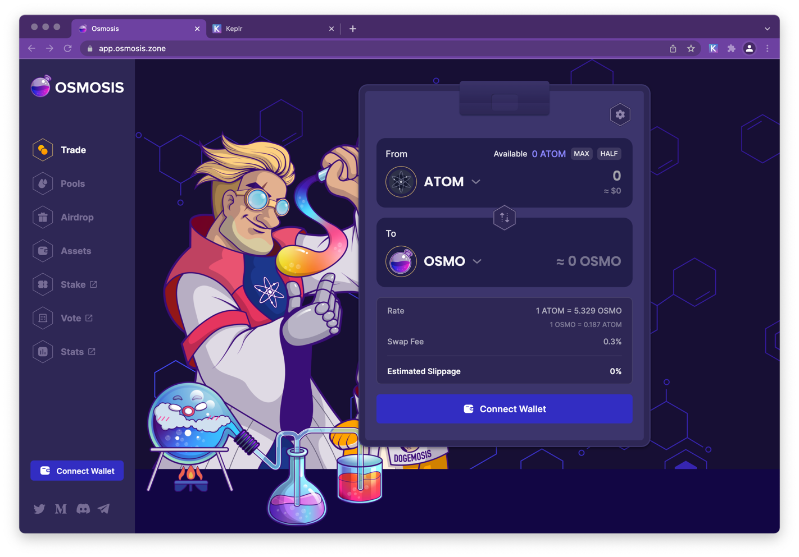
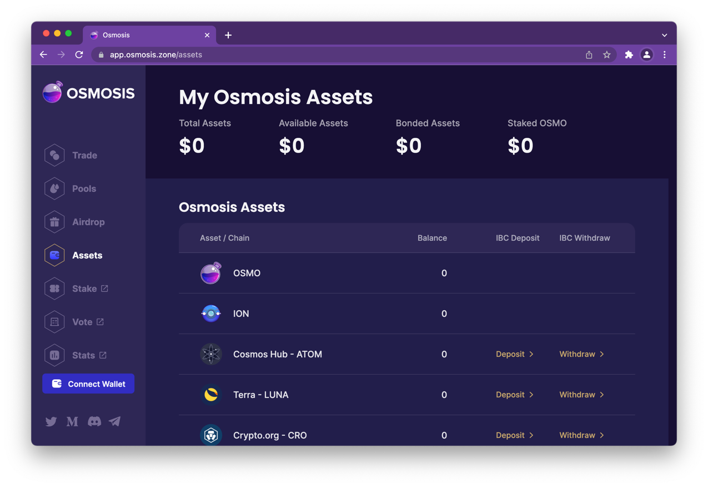
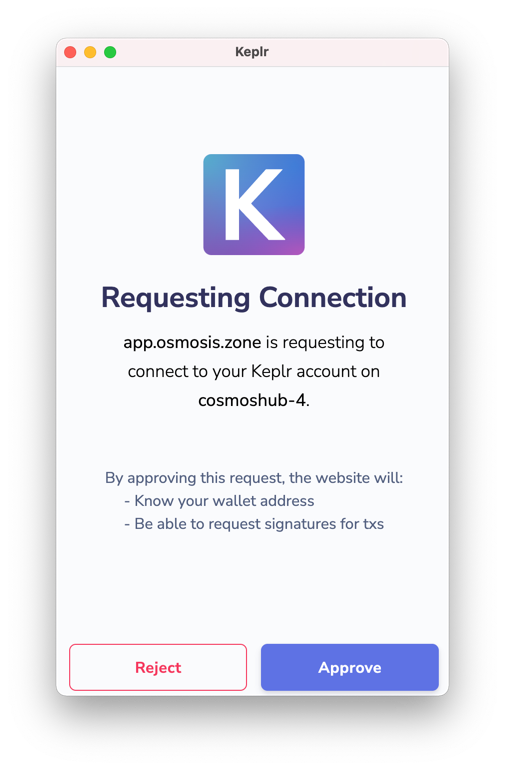
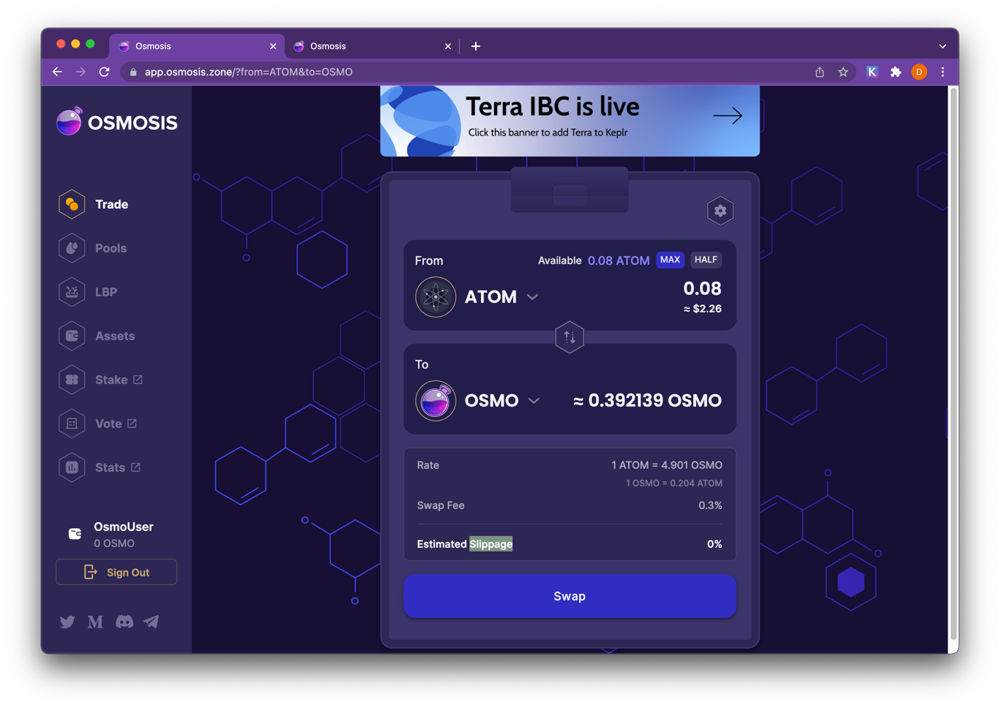
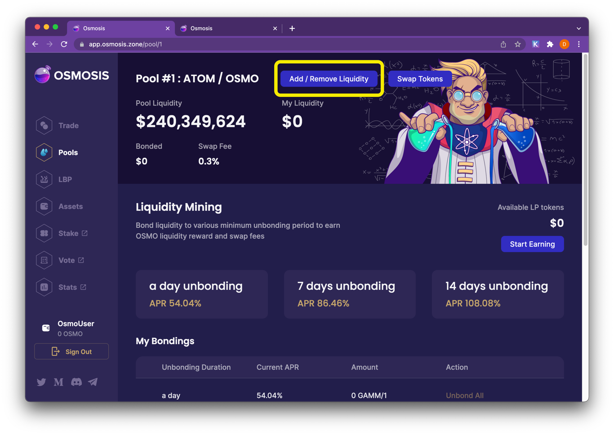
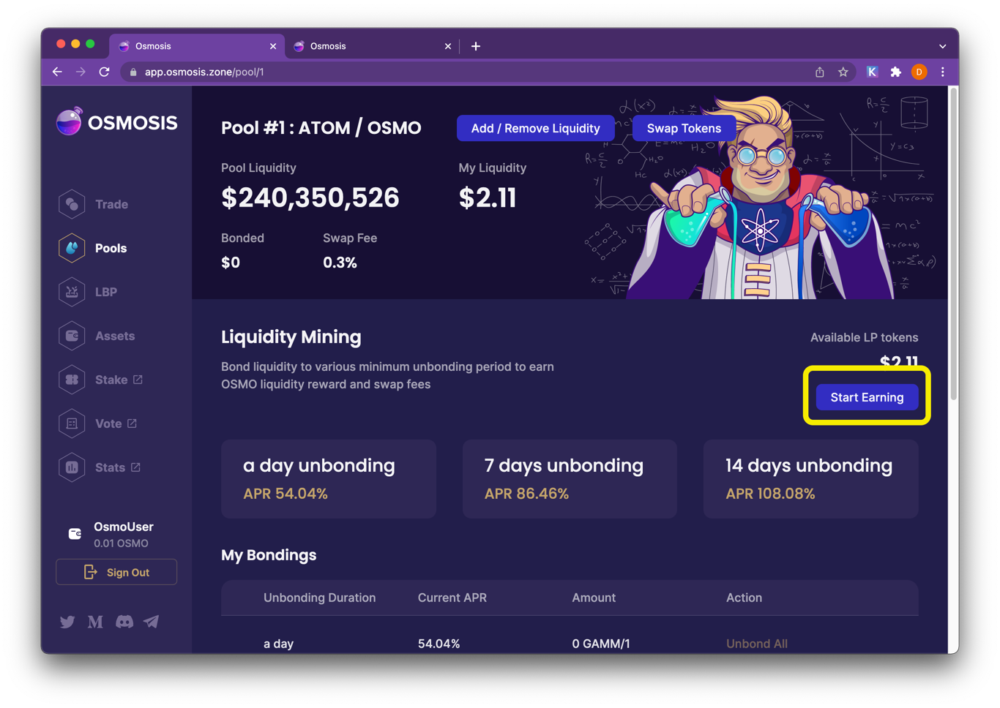

# Getting Started
## Set up a Wallet
Before opening the Osmosis AMM App, make sure to install a wallet such as [Keplr Wallet](https://www.keplr.app/).

## Open the App
Go to [https://app.osmosis.zone/](https://app.osmosis.zone/)

## Connect Wallet

Click Approve. This confirms that you are connecting to the app.osmosis.zone and the chain osmosis-1.

Always make sure you are connected to app.osmosis.zone name and network (osmosis-1)

## Deposit Funds

Click Assets. Then click on the deposit link next to the asset name. For this example we are clicking the ATOM deposit link. 

Accept connection to cosmoshub-4

 

Once connected, select how much you would like to deposit, then click the deposit button

Approve the transaction

Once the transaction is completed a series if confirmations notifications will  be displayed including the IBC confirmation.

## Swapping Tokens

Trading tokens is as easy as clicking on the Trade link and then selecting the pair you would like to trade.  Check out the [glossary](terminology.md) to learn about terms such as [slipage](terminology.md#slippage). 

## Adding Liquidity to a Pool
Select a pool from the [Pools](https://app.osmosis.zone/pools) page.

Then click Add/Remove Liquidity

Input a quantity of one of the assets. The quantity of the other asset(s) will auto-complete. (Pools require assets to be deposited in pre-determined weights.)

:::warning Warning
Please note that simply adding liquidity will not give you rewards. In order to get rewards you must bond LP tokens. 
:::

To remove liquidity, input the percentage amount to withdraw.

Incentivized pools receive OSMO liquidity mining rewards. Rewards are distributed to bonded LP tokens in these pools that meeting the bonding length criteria.

Swap fees are fees charged for making a swap in an LP pool. The fee is paid by the trader in the form of the input asset. Pool creators specify the swap fee when establishing the pool. The total fee for a particular trade is calculated as percentage of swap size. Fees are added to the pool, effectively resulting in pro-rata distribution to LPs proportional to their share of the total pool.

## Bonding LP Tokens
 Start Earning! Users can choose to bond their LP tokens after depositing liquidity. LP tokens remain bonded for a length of their time of their choosing. Bonded LP tokens are eligible for liquidity mining rewards if they meet the minimum bonding length requirement.

Click Start Earning and choose a bonding length.

### External Incentives

Osmosis not only allows the community to add incentives to gauges. Anyone can deposit tokens into a gauge to be distributed. This feature allows outside parties to augment Osmosis’ own liquidity incentive program.

For example, there may be an ATOM< >FOOCOIN pool that has a one-day gauge incentivized by governance OSMO rewards. However, the Foo Foundation may also choose to add additional incentives to the one-day gauge or even add incentives to a new gauge (such as one-week gauge).

These external incentive providers can also set up long-lasting incentive programs that distribute rewards over an extended time period. For example, the Foo Foundation can deposit 30,000 Foocoins to be distributed over a one-month liquidity program. The program will automatically distribute 1000 Foocoins per day to the gauge.

